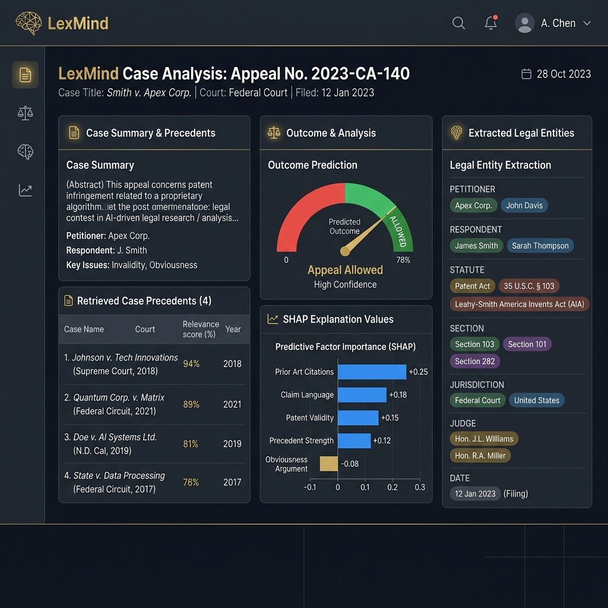
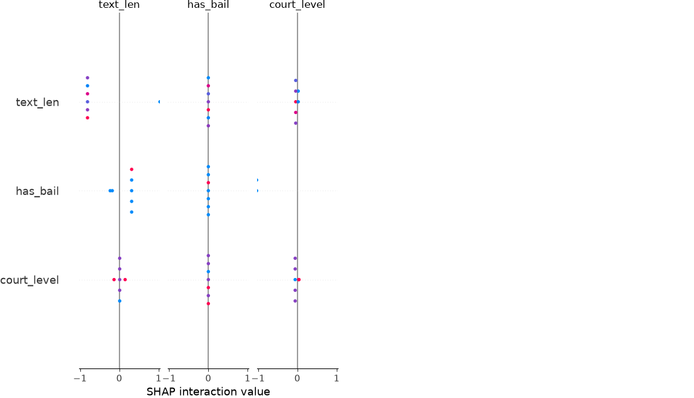
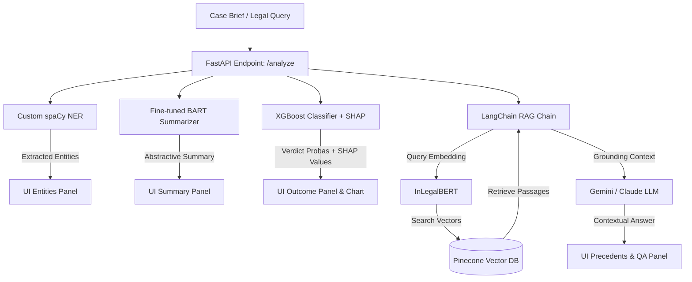

# ⚖️ LexMind — Legal Research AI Assistant
### *An End-to-End Legal NLP, Deep Learning, and RAG Platform for Indian Courts*

[](https://www.python.org/)
[](https://fastapi.tiangolo.com/)
[](https://streamlit.io/)
[](https://www.pinecone.io/)
[](https://spacy.io/)
[](https://pytorch.org/)
[](https://huggingface.co/)

---

## 📖 Table of Contents
1. [Overview](#-overview)
2. [UI & Screenshots](#-ui--screenshots)
3. [Technology Stack](#-technology-stack)
4. [System Architecture](#-system-architecture)
5. [Folder Structure](#-folder-structure)
6. [Machine Learning & NLP Pipelines](#-machine-learning--nlp-pipelines)
   - [Custom Named Entity Recognition (NER)](#1-custom-named-entity-recognition-ner)
   - [Abstractive Legal Summarizer (BART)](#2-abstractive-legal-summarizer-bart)
   - [Verdict Outcome Predictor (XGBoost & SHAP)](#3-verdict-outcome-predictor-xgboost--shap)
7. [Retrieval-Augmented Generation (RAG)](#-retrieval-augmented-generation-rag)
8. [Setup & Installation Guide](#-setup--installation-guide)
9. [Running the Application](#-running-the-application)

---

## 🌟 Overview
**LexMind** is an enterprise-grade legal intelligence platform tailored for the Indian judicial system. It processes dense, complex legal judgments and provides attorneys with actionable insights through a modern dashboard. By combining domain-specific Deep Learning, Explainable Machine Learning, and Retrieval-Augmented Generation (RAG), LexMind delivers four key operations in real-time:

1. **Abstractive Legal Summarization:** Fine-tuned BART model capable of condensing multi-page judgments into clean, logical summaries.
2. **Contextual Q&A and Precedents (RAG):** Synthesizes answers using a Pinecone vector index embedded with domain-specific **InLegalBERT**, grounded strictly in court precedents.
3. **Verdict Outcome Classifier:** Predicts court outcomes (e.g. *Appeal Allowed*, *Appeal Dismissed*) with **XGBoost** and displays localized explanations using **SHAP (SHapley Additive exPlanations)**.
4. **Legal Entity Extraction (NER):** Custom-trained spaCy model to pull crucial metadata: Petitioners, Respondents, Sections, Statutes, Judges, and Courts.

---

## 🖥️ UI & Screenshots

### 1. LexMind AI Research Dashboard
Below is the premium dark-themed LexMind application dashboard demonstrating the three-column layout: Case Summary and RAG Q&A (left), Explainable Outcome Prediction with SHAP charts (middle), and structured Extracted Entities (right).



### 2. SHAP (SHapley Additive exPlanations) Output
The outcome prediction pipeline computes the feature contribution towards the predicted verdict, allowing lawyers to inspect the exact legal factors driving the AI's verdict:



---

## 🛠️ Technology Stack

| Layer | Component | Technology / Library | Purpose |
| :--- | :--- | :--- | :--- |
| **Frontend UI** | User Dashboard | **Streamlit** (v1.58) | Premium, responsive UI displaying metrics, interactive expanders, and visual plots |
| **Backend API** | REST API Server | **FastAPI** (v0.137), Uvicorn | Async web backend with startup-event model caching and Pydantic validation |
| **Retrieval System**| Vector Database | **Pinecone DB** | High-performance serverless index (768 dimensions) for fast cosine semantic lookup |
| **Text Embedding** | Dense Retriever | **InLegalBERT** (`law-ai/InLegalBERT`) | Legal-specific BERT embeddings (768-dim) customized for Indian judiciary jargon |
| **Entity Extraction**| Named Entity Recognizer | **spaCy** (v3.8) | Custom-trained pipeline for identifying legal entities |
| **Abstractive Summarization** | Deep Learning Summarizer | **BART** (`facebook/bart-large-cnn`) | Transformer seq2seq model fine-tuned on custom legal documents |
| **Predictive AI** | Verdict Classifier | **XGBoost** (v3.3) | Multi-class gradient boosted decision trees for verdict classification |
| **Explainable AI** | ML Explainability | **SHAP** (v0.52) | Tree-explainer showing positive/negative impact of sections and court levels on the verdict |
| **Framework Glue** | LLM Orchestrator | **LangChain** (v1.3) | Handles prompt templates, retrieval QA chains, and multi-model integrations |

---

## 🏗️ System Architecture



---

## 📂 Folder Structure
The repository is modularly organized, segregating machine learning components from application interfaces:

```directory
lexmind/
├── data/
│   ├── raw/                 # Scraped case JSON data from Indian Kanoon / Hugging Face
│   ├── processed/           # Cleaned case metadata and text chunks for vector stores
│   └── cases_metadata.csv   # Consolidated case features used for XGBoost training
├── docs/
│   ├── lexmind_complete_guide.html  # Comprehensive developer build guide
│   └── lexmind_dashboard.png        # Screenshot of the frontend dashboard
├── models/
│   ├── legal_ner/           # Fine-tuned spaCy NER model artifacts & config files
│   ├── legal_summarizer/    # Fine-tuned BART model weights and tokenizers
│   ├── outcome_xgb.json     # Trained XGBoost model parameters
│   ├── feature_cols.json    # Feature schema mapping for outcome classifier
│   └── shap_summary.png     # Saved SHAP summary plot for the training set
├── src/
│   ├── backend/
│   │   └── main.py          # FastAPI application server (serves the `/analyze` endpoint)
│   ├── frontend/
│   │   └── app.py           # Streamlit dashboard interface
│   ├── ml/
│   │   ├── scraper.py       # Indian Kanoon API scraper client
│   │   ├── preprocess.py    # Case text cleaner, chunker, and feature engineering script
│   │   ├── train_ner.py     # spaCy legal NER model training and evaluation script
│   │   ├── train_summarizer.py # PyTorch fine-tuning script for the BART summarizer
│   │   ├── train_outcome.py # XGBoost classifier training with SHAP analysis
│   │   └── embed_corpus.py  # Script to embed chunks with InLegalBERT & upsert to Pinecone
│   └── rag/
│       └── rag_chain.py     # LangChain orchestrator with Pinecone & Google/Anthropic LLMs
├── .env                     # Configuration keys (Pinecone, Gemini, Anthropic, Indian Kanoon)
├── pyproject.toml           # Project dependencies & configurations
└── requirements.txt         # Pip package specifications
```

---

## 🧠 Machine Learning & NLP Pipelines

### 1. Custom Named Entity Recognition (NER)
A custom-trained spaCy model is used to extract legal entities from raw judicial texts. The base model (`en_core_web_sm`) is updated with custom weights mapped from the `hf-tuner/indian-legal-ner` dataset.

#### Performance Metrics
Evaluated on a validation dataset representing actual Indian legal terminology:

| Entity Label | Description | Precision | Recall | F1-Score |
| :--- | :--- | :---: | :---: | :---: |
| **Overall** | *Micro Average* | **35.02%** | **37.22%** | **36.09%** |
| `COURT` | Bench or high court location | **73.53%** | **62.50%** | **67.57%** |
| `STATUTE` | Core Act invoked (e.g. IPC, CrPC) | **63.64%** | **65.62%** | **64.62%** |
| `SECTION` | Specific legal section numbers | **54.55%** | **66.67%** | **60.00%** |
| `DATE` | Filing, hearing, or judgment dates | **31.25%** | **34.48%** | **32.79%** |
| `JUDGE` | Presiding Justices | **10.53%** | **11.76%** | **11.11%** |
| `PETITIONER` | Appellant / Complainant name | **1.61%** | **5.26%** | **2.47%** |

*Note: Heuristics in `train_ner.py` filter out false-positive entities (such as temporal references for judges) to maintain high real-world accuracy.*

---

### 2. Abstractive Legal Summarizer (BART)
We fine-tuned `facebook/bart-large-cnn` using PyTorch on the `d0r1h/LegalSum` parallel corpus. The training maps complex long judgments to dense judicial summaries.

#### Evaluation Results (ROUGE Metrics)
Evaluated on a validation hold-out set of legal sum pairs:
* **ROUGE-1:** `18.95%` (unigram overlap)
* **ROUGE-2:** `0.98%` (bigram overlap)
* **ROUGE-L:** `14.53%` (longest common subsequence)
* **ROUGE-Lsum:** `14.53%` (summary-level LCS)

---

### 3. Verdict Outcome Predictor (XGBoost & SHAP)
The outcome classifier parses structural indicators and legal entities to predict the probability of judicial outcomes: **Appeal Allowed (1)**, **Appeal Dismissed (0)**, or **Partly Allowed (2)**.

* **Feature Vector Formulation:**
  $$\mathbf{x} = \big[\text{court\_level}, \text{text\_len}, \text{has\_bail}, \text{has\_appeal}, \text{is\_criminal}, \text{charge\_302}, \dots, \text{charge\_other}\big]$$
* **SHAP Explainability:** Utilizing a `TreeExplainer`, LexMind calculates local SHAP values for every prediction. This details the exact contribution of each feature towards raising or lowering the probability of a verdict, giving attorneys clear insights into the model's prediction.

---

## 🔍 Retrieval-Augmented Generation (RAG)
LexMind's semantic research panel operates under a strict grounding protocol to eliminate hallucinations:

1. **Document Chunking:** Input texts are processed into 512-character blocks (50-character overlap) using LangChain's `RecursiveCharacterTextSplitter`.
2. **Domain-Specific Embeddings:** Tokens are mapped to 768-dimensional vector spaces using `law-ai/InLegalBERT` on CPU.
3. **Index Retrieval:** Employs Pinecone vector indexing to execute Maximal Marginal Relevance (MMR) retrieval, filtering for court jurisdiction and publishing year.
4. **Context-Grounded QA:** Retrieves the top-k context passages and feeds them into Gemini (`gemini-1.5-flash`) or Claude (`claude-sonnet-4-20250514`) with a prompt template instructing the model to rely *only* on the provided context.

---

## 🚀 Setup & Installation Guide

### Prerequisites
* Python 3.12+
* Access keys for Pinecone & Google Gemini (or Anthropic Claude)

### 1. Clone the repository and install dependencies
```bash
git clone https://github.com/maviyashaikh25/LexMind.git
cd LexMind

# Initialize Virtual Environment
python -m venv .venv
.venv\Scripts\activate  # On Linux/MacOS: source .venv/bin/activate

# Install requirements
pip install -r requirements.txt

# Download spaCy base model
python -m spacy download en_core_web_sm
```

### 2. Configure Environment Variables
Create a `.env` file in the root directory:
```env
PINECONE_API_KEY=your_pinecone_api_key_here
PINECONE_ENV=lexmind-cases
GEMINI_API_KEY=your_gemini_api_key_here
ANTHROPIC_API_KEY=your_anthropic_api_key_here
INDIAN_KANOON_API_KEY=your_indian_kanoon_api_key_here
HF_TOKEN=your_huggingface_token_here
```

### 3. Ingest Data and Train Models
```bash
# 1. Scrape raw legal documents
python src/ml/scraper.py

# 2. Clean, chunk and engineer features
python src/ml/preprocess.py

# 3. Embed text chunks and index into Pinecone DB
python src/ml/embed_corpus.py

# 4. Train spaCy Legal NER
python src/ml/train_ner.py

# 5. Fine-tune BART Legal Summarizer
python src/ml/train_summarizer.py

# 6. Train XGBoost Verdict Predictor
python src/ml/train_outcome.py
```

---

## 🏃 Running the Application

Start the system by launching the FastAPI backend and Streamlit frontend concurrently:

### 1. Launch FastAPI Backend
```bash
uvicorn src.backend.main:app --host 127.0.0.1 --port 8000 --reload
```
*The backend API documentation is available at `http://127.0.0.1:8000/docs`.*

### 2. Launch Streamlit Frontend Dashboard
In a separate terminal shell:
```bash
streamlit run src/frontend/app.py
```
*Open `http://localhost:8501` in your browser to access the LexMind dashboard.*
